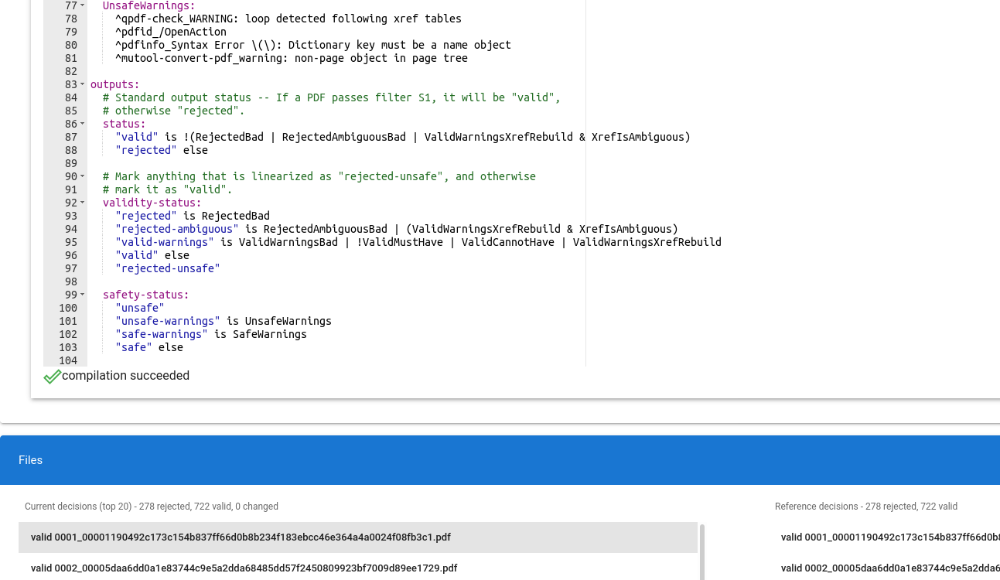

# Format Analysis Workbench (FAW)

The Format Analysis Workbench (FAW) is a platform for running and analyzing the
output from any number of parsers dealing with a single file format. It is meant
to be a workbench for developing tools which aid in understanding the de facto
formats which naturally emerge from open standards.

 

## Example Screenshots

Main overview of decisions

Decision DSL excerpt

## Getting Started

To get started, run:

    pip3 install -r requirements.txt
    python3 workbench.py pdf ./test_files/pdf

The first invocation will take a long time (up to an hour or two). After that,
it will be quite fast. Once it's loaded, point your browser at
http://localhost:8123

## Development mode by default

When integrating a new parser or developing a plugin, consider not passing the `--production`
flag to the `python3 workbench.py` command. This does a number of things:

1. Mounts all folders in docker, rather than including them in the image. This
   way, changing a plugin's source code immediately takes effect.
2. Continuously scans for changes to any `config.json5` file, and reloads config
   on change. Changing any `'version'` field in a `config.json5` is intended to
   trigger reprocessing in the database, to enable rapid iteration.
3. Watches for filesystem changes; if a file is created or modified _while the
   FAW is running_, then all analysis sets will be reprocessed to include the
   new or modified file. This can be useful for debugging specific file malforms.
4. For internal development, enables live-reloading of all user interface
   components.

## Creating a new distribution

This README documents the Galois Format Analysis Workbench (GFAW) for developers
creating their own distributions of the workbench. The core workbench source
in `common` should remain unchanged, but distribution creators are encouraged to
develop their own plugins to support new file formats or enhance support for
existing formats.

To create a new distribution, create a new subfolder, modeled off of the `pdf`
base distribution. Available options are documented in `config.json5` within
that folder.

Please do not add other files directly to this folder. For development purposes,
such as keeping a private workbench distribution, the configuration for a
distribution might be kept in the parent folder to which the FAW is cloned.
E.g., one might run:

    python3 workbench.py ../my-pdf ./test_files/pdf

Due to the design of Docker, running this will upload all contents of `..` to
the Docker daemon, which may be time consuming and wasteful. If using this
feature, please ensure the parent folder is as empty as possible, preferentially
only containing the FAW folder and the private distribution. Note that multiple
cloned FAWs will mostly use the same Docker images, so no need to worry about the
inefficiency of cloning FAW multiple times. The exception is that two builds
will be maintained -- one for non-parent-directory distributions, and one for
parent-directory distributions.

While developing a distribution, consider not using `--production` to use Vue's
live reload functionality and to mount the distribution's folder into
`/home/` in a way which allows for making changes without stopping and starting
the development server.

--development live-reloads all plugins, including parsers, file views, and
decision views. For file or decision views, simply re-run the plugin from the
UI. For plugins, edit `config.json5` to change the `version` field of the
modified parser. Then, in the UI, press "Reset DB -> Reset Most..." to trigger
the re-execution of that parser.

To build a standalone workbench in `build/label`, run:

    python3 workbench.py pdf build/label

See `common/README-dist.md` for additional information on running the workbench
docker image in a standalone fashion; that file is packaged with any builds.

## Database backup

Running `./workbench.py <DIST> <FOLDER> --copy-mongo-to <FILE>` will create a
backup of the current database for `<DIST>` and `<FOLDER>` at `<FILE>`, which
must be specified as an absolute path. This backup may be restored by running
`./workbench.py <DIST> <FOLDER> --copy-mongo-from <FILE>`, again using an
absolute path.

## Troubleshooting

1. Should the web interface fail to start, try deleting
  the `common/pdf-observatory/ui/node_modules` directory and trying again. This
  can happen due to mismatches between node versions in docker containers.

2. When not in `--production` mode, attaching to the docker container gives access to
  a variety of useful information. In particular, `s6-logwatch /var/log/observatory`
  will show the logs for the FAW instance; `/var/log` in general contains a
  number of logs on the various processes which comprise the FAW. Futhermore,
  if the server itself ever needs to be rebooted, there is a `faw-restart.sh`
  executable in the PATH which can help do this correctly.

3. The FAW docker image contains a binary which can be used to view all logs,
  restart the FAW process, or inspect the database in a REPL. For these functions,
  run e.g. `docker exec -it <CONTAINER> faw-cli.py`.

4. When using FAW with a large set of files/directories, it is possible for NodeJS 
  to hit the limit on the maximum number of file watchers allowed. This is usually
  indicated by a `ENOSPC` error in the logs. This issue must be addressed on the host
  machine (and not the container). The current limit on the host machine can be checked 
  via: `cat /proc/sys/fs/inotify/max_user_watches`. To increase this limit do something like: 
  `echo 'fs.inotify.max_user_watches=524288' | sudo tee -a /etc/sysctl.conf`.
  See [here](https://howchoo.com/node/node-increase-file-watcher-system-limit#why-do-i-see-this-enospc-file-watch-limit-error) 
  for more details.

5. Additional documentation is in the [docs](docs) directory.

## Acknowledgements

This material is based upon work supported by the Defense Advanced Research 
Projects Agency (DARPA) under Contract No. HR0011-19-C-0073. Any opinions, 
findings and conclusions or recommendations expressed in this material are those 
of the author(s) and do not necessarily reflect the views of the Defense Advanced 
Research Projects Agency (DARPA).
