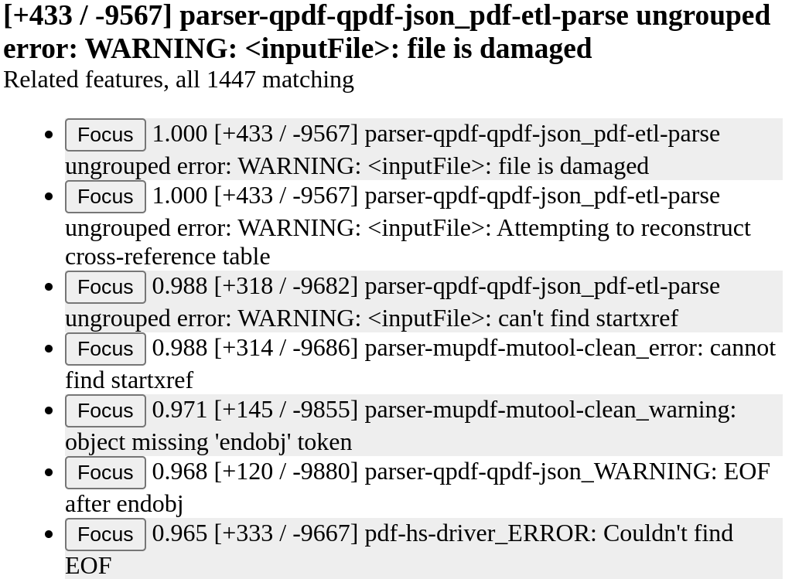

# Introduction


As a data format gains popularity, the number of parsers and parser-like
tools developed to process it increases significantly. Even in the
presence of a format specification, these tools often interpret it in
subtly different ways. Moreover the data format and its specification
also tend to evolve over time to accommodate new use cases and user
demands. Together, this can cause significant divergence in the output
of parsers leading to *parser differentials*, a situation where two
parsers exhibit semantically different behavior for the same input,
which is a well-known and practically exploited vulnerability.

Identifying parser differentials and exploits is often a time-consuming
task involving multiple iterations of hypothesizing, developing
special-purpose tools, running against a file corpora and analysing the
results. Reducing the manual aspects of this cycle can serve to
significantly accelerate this loop and enable investigations on much
larger file corpora and with more parsers and tools than manually
possible. Further, such scaling also enables the discovery of
statistical correlations between the outputs of the tools which can help
to surface the root causes of many differentials and exploits.

The Format Analysis Workbench (FAW) provides a workbench for
file-format analysis that enables users to easily create and integrate
new as well as existing tools and parsers for formats and compare and
contrast their behavior against large file corpora scaling up to
millions of files. The FAW has been designed as a flexible tool to
examine and understand data formats and allow different types of users
to work with these formats from different perspectives. For example:

- Specification writers: the FAW makes it easy to compare various
  parsers that implement the spec as well as examine the kind of
  documents that are available in the wild and how they interpret the
  specification.
- Parser Developers: in addition to the parser comparisons mentioned
  above, the FAW also makes it easy to make changes to a parser and test
  parser behavior against large corpus.
- Vulnerability Researchers: the FAW allows easy incorporation of new
  ananlysis to dig more in to the programs and the specification under
  test.

# Screenshot

Main overview of decisions


# Architecture of the FAW

Exploring data formats via input corpora at scale requires an
infrastructure to run parsers and associated tools against input files
in the corpus and capture their behavior. The FAW is divided in to a
backend that handles the details of running parsers against the input
corpus, and a frontend that enables users to investigate the behavior of
parsers and tools against files in the corpus, at different scales and
granularities.

Parsers and parser-like tools are provided as binary executables and can
be written in any language, and using any technology. Further FAW
supports processing the file corpus either on a single machine or in
parallel on a cluster of machines. The latter, termed a "teaming" setup,
can be performed on a private network without requiring internet access.

The FAW allows the user to specify analysis sets to control the scale
and speed of analyses. It also provides multiple tools are provided to
explore the interactions between inputs and parsing programs in the
analysis set.


# Quick Start

Running the FAW requires an installation of Python (\>= 3.8) and Docker.
In order to start an instance:

- Clone the repository
- Install the prerequisites with `pip3 install -r requirements.txt`
- Launch the startup script `workbench.py` with two paths: the path to a
  *distribution folder* and one to the file corpus being studied.

A FAW distribution is a specific configuration of the FAW and is usually
associated with a specific file format. The FAW repository
includes a small set of distributions and corresponding file corpora,
for example PDF. The PDF distribution can be launched from the root
folder with the following command: `workbench.py pdf test_files/pdf`.

The workbench script builds a docker image for the distribution on the
fly and launches an instance of the FAW. The FAW user interface is
accessible via a webbrowser at `http://localhost:8123` (by default).

By default, FAW is launched in [developer mode](#developer-friendly-features).


In addition to directly running the distribution, the workbench script is capable of building and saving a unified docker image for a FAW distribution, which can can simplify deployment. Additionally, the FAW supports deployment in a multi-server "teaming mode" using [pyinfra](https://pyinfra.com/), which is useful when working with large corpora. The repository includes the `workbench-teaming-init.py` script for creating the pyinfra inventory/deploy files; pyinfra tooling can then be used to install prerequisites on target machines and set up FAW images and services. In this mode, target machines process files independently, but share a single database. The FAW UI is made available via a webserver on the database's machine.

# FAW Concepts

## Distribution

A distribution is a specific configuration of the FAW. Each distribution is a folder containing a top-level `config.json5` file and potentially, a collection of plugins. For details regarding distributions and creating one for a new file format, take a look at [this guide](docs/tutorial-distribution.md).

## Corpus

A corpus is essentially a directory containing files of interest. Arranging files in a hierarchy via subfolders is supported and encouraged, particularly for large corpora. 

As mentioned in earlier sections, an instance of the FAW is associated with a single distribution and corpus. At runtime, the FAW runs all configured parsers and tools against all files in the corpus. Further, updates to the corpus, including additions and modifications, will cause the FAW to rerun the parsers/tools on the changed files.

This repository contains a few corpora to both serve as examples and to help users get started with the FAW quickly. However, creating a new corpus is as simple as creating a new directory, adding relevant files to it (potentially arranging them in a hierarchy) and starting the FAW instance with a path to this directory.

While accruing representative files for any given format is not strictly within the purview of the FAW, it is worth noting that significant efforts have been expended to collect and create digital corpora for many extant formats. For example, the [CommonCrawl 8M corpus (CC-MAIN-2021-31-PDF-UNTRUNCATED)](https://digitalcorpora.org/corpora/file-corpora/cc-main-2021-31-pdf-untruncated/), collated as part of the DARPA SafeDocs program, includes around 8 Million PDF files collected from all over the publically accessible internet, while others like [GovDocs](https://digitalcorpora.org/corpora/file-corpora/files/) contain a mix of file formats (in this case collected from  `.gov` domains). These corpora can serve as the basis of any investigations into extant formats.

For large, multi-terabyte corpora, keep in mind that a correspondingly large hardware investment will be needed to re-run new or updated tools against the corpus. This is necessary to support both continuously improving these tools and developing ad hoc tools that provide users with file format views unique to their concerns. As a result, for exploratory applications where hardware is limited, we encourage users who want to work with large corpora to subsample the larger corpus to a size appropriate for the hardware available to them.

## Binary Features

FAW adopts the notion that binary features can effectively capture information about parser-input interactions. Binary features can capture and represent a wide variety of information: is the input document a PDF? Was parsing successful? Were error messages regarding a specific field printed on the standard error? etc. Analying the relationships between these features can provide deep insight in to the behavior of parsers/tools with respect to the corpus and format at scale.

Parsers within the FAW can be configured to automatically extract features from the output of the underlying tool (see, for example, the configuration in this [tutorial section](docs/tutorial-distribution.md#getting-started) or the more comprehensive ones that are part of the PDF distribution). These features can be further [filtered and aggregated](filtering-and-discrepancy-analysis) via the Decision DSL to enable automatic decisions of validity.

## Analysis Sets

As discussed in the [Corpus](#corpus) section, the FAW executes all
parsers and tools on the entire corpus. However, it might not always
be useful or practical to work with the complete results; instead,
it may be convenient to focus on a subset thereof. The FAW introduces
the concept of *analysis sets* to address this requirement, enabling
users to group files and parsers into subsets for visualization and
analysis workflows. This feature is intended to enhance the user's
ability to efficiently explore and analyze data at different
granularities within the FAW.

Analysis sets group together a subset of files in the corpus and a
subset of parsers/tools. The FAW facilitates the creation, modification,
and deletion of analysis sets, and allows seamless switching between
them at runtime. Upon selecting an analysis set, the FAW gui visualizes
the results of the interactions between the set of files and parsers
included in the set. This includes both the raw feature listings and
automatic (validity-related) decisions computed via the decision DSL. 


# Capabilities of the FAW

The FAW offers a number of features/capabilities to the user out of the
box that we describe in the following sections.

## Filtering and Discrepancy Analysis

FAW distributions typically include file parsers for parsing files and
extracting features. While manual validation of features is possible, it
is more convenient to have automatic decisions based on user-defined
criteria. The FAW offers a simple, custom domain-specific language (DSL)
for expressing decision criteria based on *filters* and *outputs*.
Filters are groups of expressions and are matched against parser
generated features while outputs, expressed in terms of compound boolean
expressions over filters, represent aggregations of filter criteria.

Below we include a snippet of the decision DSL extracted from the PDF distributinon,
which creates two filters based on features produced by the `mutool clean` command.
`MuCleanAccept` filters files that have a zero exit code from `mutool`, while 
`MuCleanError` filters files that either have a non-zero exit code or include a feature
matching the regex: `.*[Ee]rror(?!: .*marker)`. Additionally, the snippet
defines an output: files satisfying `MuCleanAccept` and not satisfying
`MuCleanError` are labeled `valid`, otherwise, they are labeled `rejected`.
```
filters:
  MuCleanAccept:
    ^mutool-clean_.*<<workbench: Exit code0>>
  MuCleanError:
    ^mutool-clean_.*<<workbench: Exit code(?!0)
    ^mutool-clean_.*[Ee]rror(?!: .*marker)
outputs:
  status:
    "valid" is MuCleanAccept & !MuCleanError
    "rejected" else
```

The configuration for the various distributions includes other, more complex,
examples of the decision DSL.

The decision DSL adjustments impact the FAW UI, with filter and output
clauses represented as radio buttons in the UI. Selecting these buttons
filters the file list to display only the files that meet the criteria
specified in the DSL.

The FAW also enables users to upload structured JSON files containing
reference decisions for files in a corpus. These "gold standard"
decisions are automatically compared to the decisions made by the
current DSL, highlighting any discrepancies for users to investigate and
identify files that do not match expectations.

## Extensibility

The FAW is designed to accommodate diverse input formats, parsers, and
visualization tools. It employs a plugin architecture with extension
points and an API, enabling users to create custom plugins tailored to
their specific corpus and workflow. Plugins can be developed for parsing
new file formats and visualizing data from the corpus. The FAW supports
various plugin types, which are further described in subsequent
sections.

### Parser Plugins

The FAW supports parser plugins that validate file formats and extract
format-specific features. These plugins execute external commands to
parse files, capturing the exit code and standard output/error. The FAW
allows mapping of these outputs to human-understandable features using
regular expressions, with options for replacement and capture. The
extracted features are stored in the database and can contribute to the
valid/invalid decisions via the decision DSL mentioned in the [previous
section](#filtering-and-discrepancy-analysis).

The PDF distribution contains many examples of parser plugins, many of which
are wrappers around extant parsing tools.

### File-Detail Plugins

File detail view plugins in the FAW visualize file contents by rendering
them as HTML or other browser-displayable formats. Similar to parser
plugins, they execute an external command that transforms the file
content and streams it to the standard output. The FAW captures and
renders this content in the browser based on the provided MIME type. An
example of a file detail view plugin is PolyFile, which creates
interactive HTML reports for various file formats, enabling users to
view and search data structures within the file.

### Corpus-Level Plugins

Decision plugins in the FAW operate on the entire corpus, aggregating
and visualizing information about dialects or common patterns. Like
other plugins, they execute external commands, but can access the
complete corpus and features captured during parser invocations.

Results from the command are expected to be streamed in JSON line
format, and the FAW can be optionally configured to capture and render
custom HTML files generated by the plugin. This flexibility allows
decision plugins to introduce new UI elements and actions within the
FAW. FAW's root cause analysis are implemented as decision plugins.

### Pipeline Plugins

The FAW supports complex plugins with multiple stages and the capability
to generate new data-driven parsers based on corpus inputs.

If you would like to create new pipeline plugins, take a look at 
[the tutorial](doc/tutorial-pipelines.md) here.

### Transforming Inputs and Universal Output Parsers

The FAW allows for input transformers that dynamically modify inputs
before processing them. These transformers take a file from the corpus
as input run external commands that produce transformed content on the
standard output. Transformed inputs are treated as transient and not
permanently stored. The SDF distribution, for example, use input
transformers to generate a large corpus of SDF files from very simple
seed input.

The FAW also supports universal parser parsers, which operate on the
output of all configured parsers, generating additional features. These
parsers run external commands that accept specially formatted streams
and emit JSON dictionaries of new features. Universal parser parsers
are intended to unify format-specific considerations across all parsers.

## Root Cause Analysis

The FAW contains plugins that build on the perspective that groups of files could be viewed topologically [[Ambrose 2020](https://arxiv.org/pdf/2003.00976.pdf), [Robinson 2021](https://arxiv.org/pdf/2012.10211.pdf)]. Specifically, these plugins extrapolate this theory to answer questions related to specific features: what caused a given exit code or parser differential? In the extreme, a best-case solution to this would be a grammar succinctly and perfectly matching only inputs that would trigger the condition. Grammar inference being a difficult problem, the next best approach seemed to be finding other features that robustly implied -- or at least greatly contributed to the likelihood of -- a desired condition.

To achieve this, we turned to the absolute risk reduction metric [[Rothman 2012](https://www.cabdirect.org/cabdirect/abstract/20033069049)]. For our use case, we adapt it as $ARR(A, B) = P(A|B) - P(A|\neg B)$, where $A$ and $B$ are two features of interest. Conveniently, this metric becomes zero when the two features are independent, $1$ when they are identical, and $-1$ when they are inverted ($A = \neg B$). To filter out noise, we additionally do not consider features with $min(P(A), 1 - P(A)) < \epsilon$. As the metric is asymmetric, a trick we use is to take $ARR(A, B)$ iff $|ARR(A, B)| > |ARR(B, A)|$, and $ARR(B, A)$ otherwise. The result is that IMPLIES relationships have large values, regardless of the direction of implication.

For diagnostics, this simple metric is shockingly powerful -- if, e.g., exit code $Z$ only occurs on files which produce error message $Y$, then exploring either of those features will reveal the other with a large associated risk metric.

This functionality is exposed through the 'Clustering' decision plugin in the FAW, here pictured showing risk factors for a 'file is damaged' warning on a corpus of 10,000 PDF files.



## Rendering differentials

The FAW includes a rendering differential detection algorithm designed
for file formats that generate on-screen images like PDFs. Unlike
existing algorithms that often report false positives, this algorithm
reduces such errors and accurately identifies true differentials,
enabling the identification of root causes for the differences.

## PolyFile / PolyTracker Integration

Two essential tools included in most FAW distributions are [PolyFile](https://github.com/trailofbits/polyfile) and
[PolyTracker](https://github.com/trailofbits/polytracker) from Trail of Bits. PolyFile serves as a unified file format tool with parsers
for over 263 MIME file types. It detects polyglots (valid instances of
multiple formats) and provides a file detail view for inspecting parsed
structures or byte regions. PolyTracker is an instrumentation toolkit
that enhances existing parsers with taint-tracking functionality,
including control flow tracking algorithms for grammar inference and the
identification of "blind spots" that do not affect a parser's
interpretation of bytes in a file, even when mutated.

## Grammar Inference / Pipeline Plugins

Parsers like those learned through machine learning require additional
support to handle the training process. The FAW includes a pipelining
plugin system, which allows long running actions to be divided in to a
acyclic graph of resumable tasks. Tasks are processed according to the
graph with restarting of crashed tasks. Once tasks are completed,
parsers can be defined for analysis sets, file detail views, and
decision plugins. [RL-GRIT](https://langsec.org/spw21/papers.html#rlgrit) has been integrated in to FAW using pipeline plugins.

## Developer-friendly Features

The FAW offers a developer mode to support rapid development of parsers
and plugins.

### Live Reloading

In developer mode, the FAW provides live-reloading for plugins and file
inputs based on user changes. When a parser is modified and its version
field is updated, the FAW efficiently recalculates the necessary updates
to the database. This enables users to quickly iterate and explore the
impact of code changes across the entire corpus.

### CI Features

In developer mode, the FAW also supports use as a continuous integration
(CI) tool. The CI interface allows for adding, updating, and
reconfiguring parsers, executing them against the corpus, and reporting
results without direct human involvement. The interface can be accessed
via a web API or command line tool, making it suitable for various CI
scenarios such as regression tracking. When a parser configuration is
updated, a separate docker container initiates a rebuild of the parsers,
and the new binaries are copied to the FAW instance for reparsing files.
The CI interface offers an endpoint to process parse results based on a
specific decision DSL and retrieve aggregated results.

The FAW repository contains a helper script `faw/scripts/faw_ci_cli.py`
that provides two subcommands `update-config` and `get-decisions` to
interact with the CI features.


# Troubleshooting

1. Should the web interface fail to start, try deleting
  the `common/pdf-observatory/ui/node_modules` directory and trying again. This
  can happen due to mismatches between node versions in docker containers.

2. When not in `--production` mode, attaching to the docker container gives access to
  a variety of useful information. In particular, `s6-logwatch /var/log/observatory`
  will show the logs for the FAW instance; `/var/log` in general contains a
  number of logs on the various processes which comprise the FAW. Futhermore,
  if the server itself ever needs to be rebooted, there is a `faw-restart.sh`
  executable in the PATH which can help do this correctly.

3. The FAW docker image contains a binary which can be used to view all logs,
  restart the FAW process, or inspect the database in a REPL. For these functions,
  run e.g. `docker exec -it <CONTAINER> faw-cli.py`. When the FAW is run interactively,
  it automatically starts the `faw-cli`.

5. When using FAW with a large set of files/directories, it is possible for NodeJS 
  to hit the limit on the maximum number of file watchers allowed. This is usually
  indicated by a `ENOSPC` error in the logs. This issue must be addressed on the host
  machine (and not the container). The current limit on the host machine can be checked 
  via: `cat /proc/sys/fs/inotify/max_user_watches`. To increase this limit do something like: 
  `echo 'fs.inotify.max_user_watches=524288' | sudo tee -a /etc/sysctl.conf`.
  See [here](https://howchoo.com/node/node-increase-file-watcher-system-limit#why-do-i-see-this-enospc-file-watch-limit-error) 
  for more details.

6. Additional documentation is in the [docs](docs) directory.


# Acknowledgements

This material is based upon work supported by the Defense Advanced Research 
Projects Agency (DARPA) under Contract No. HR0011-19-C-0073. Any opinions, 
findings and conclusions or recommendations expressed in this material are those 
of the author(s) and do not necessarily reflect the views of the Defense Advanced 
Research Projects Agency (DARPA).

